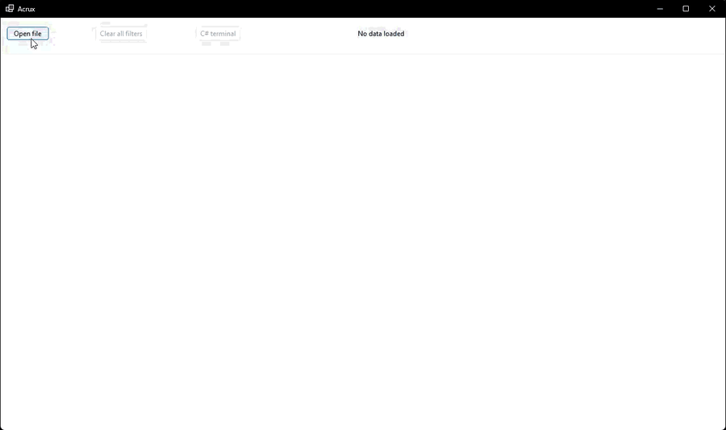
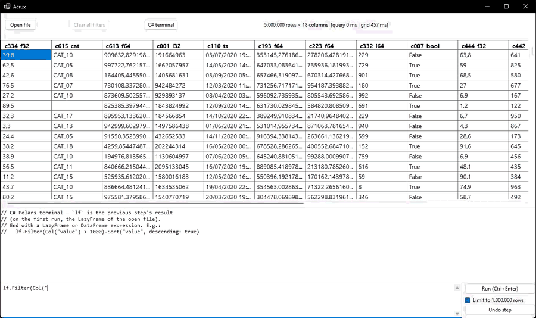

# Acrux

A Windows desktop viewer for Parquet and CSV files that are too big for Excel —
hundreds of columns, millions of rows — built on [Polars.NET](https://www.nuget.org/packages/Polars.NET)
with a grid that never loads the data it isn't showing.



## Why this exists

When I started working with data, I got used to how fast Polars and pandas read
large volumes in Python. For big database extracts — especially Parquet files —
I fell into a habit: open the Python terminal, load the file, and write custom
filters to pull out exactly the rows I needed. Doing the same thing in Excel was
frustrating by comparison: rigid built-in functions, heavy processing, and the
long wait just to *open* the file.

But the terminal habit had its own gap. Sometimes I didn't want to write code —
I just wanted to *see* the data: scroll it, click a column, filter it visually,
without spinning up an interpreter for a quick look.

As soon as I found [Polars.NET](https://www.nuget.org/packages/Polars.NET) — the same
Rust engine, now reachable from C# — I saw the read performance I was used to,
and a way to close that gap: a simple, flexible visual environment for the work
I do every day. Open the file, see the grid, click a header to filter like in
Excel, and — when clicking isn't enough — drop into a terminal and query with
real code.

## The name

Acrux is α Crucis, the brightest star of the Southern Cross — the constellation
on the Brazilian flag, and the guide star of the sky this project was built
under. Yes, the Polars mascot is a polar bear and polar bears live under the
*northern* star. He didn't mind the trip south.

## What it does

- **Opens Parquet and CSV.** CSV gets converted once to a temporary parquet
  (streaming, so RAM stays flat) and the app works on parquet from then on.
  The converter has survived every real-world file I've thrown at it:
  `;` vs `,` separators, decimal commas, Excel's "ANSI" (Windows-1252) and
  UTF-16 encodings, and columns that change type a million rows in. Each of
  those started as a bug report — usually mine.
- **Lets you pick columns before loading.** Only the selected columns are ever
  read from disk.
- **Filters like Excel.** Click a header, get the distinct values (blanks
  included), check what you want. Filters compose across columns.
- **Has a C# terminal.** The full Polars expression API against the open file,
  with `lf` as your LazyFrame:

  ```csharp
  lf.Filter(Col("city") == "São Paulo")
  lf.GroupBy("product").Agg(Col("value").Sum().Alias("total"))
  ```

  Each command chains on the previous result — applied steps, Power Query
  style — with one-click undo and restore. An optional 1M-row cap saves you
  from accidentally collecting the whole file.

  

## How it stays fast

Three rules, no exceptions:

1. **Nothing is materialized.** The data lives in Arrow buffers; the grid asks
   for one cell at a time, only for cells on screen. There is no `DataTable`,
   no paging, no copy.
2. **Filters are queries, not loops.** Every filter re-scans the file through
   Polars' lazy engine — which sounds slow and is actually tens of
   milliseconds, because only the filtered columns are read.
3. **Script steps compose one lazy plan.** Chained terminal commands aren't
   executed one by one; they're replayed as a single query, so the optimizer
   sees the whole pipeline.

## Building

```
dotnet build Acrux.csproj
dotnet run --project Acrux.csproj
```

Needs the .NET 10 SDK, Windows. Single-file publishing works:

```
dotnet publish -c Release -r win-x64 --self-contained true -p:PublishSingleFile=true
```

Two hard-earned rules are baked into the project file — don't fight them:
WinForms doesn't support `PublishTrimmed`, and the terminal needs
`IncludeAllContentForSelfExtract` (Roslyn resolves references through
`Assembly.Location`, which is empty inside a pure single-file bundle).

## Dependencies

Everything is restored automatically by `dotnet build` — nothing to install by
hand. The self-contained publish bundles the runtime too, so end users need
nothing at all.

| Package | Version | What it's for |
|---|---|---|
| [Polars.NET](https://www.nuget.org/packages/Polars.NET) (+ `Linq`, `ML`, `Native.win-x64`) | 0.6.0 | The data engine — Rust Polars, reachable from C# |
| [Apache.Arrow](https://www.nuget.org/packages/Apache.Arrow) | 23.0.0 | The in-memory columnar format the grid reads cells from (Polars.NET 0.6.0 requires ≥ 23) |
| [Microsoft.CodeAnalysis.CSharp.Scripting](https://www.nuget.org/packages/Microsoft.CodeAnalysis.CSharp.Scripting) | 5.6.0 | Roslyn — compiles the terminal's C# scripts at runtime |

## Under the hood

| File | Role |
|---|---|
| `MainForm.cs` | Virtual grid, file loading, filter orchestration |
| `DataFrameProvider.cs` | Parquet reading and CSV→parquet conversion |
| `ColumnSelectorForm.cs` | Column picker shown on open |
| `FilterEngine.cs` | Excel-style filters as Polars lazy queries |
| `FilterPopupForm.cs` | Distinct-values popup |
| `PolarsTableAdapter.cs` | O(1) per-cell reads from Arrow arrays |
| `ScriptHost.cs` | Roslyn evaluation of chained Polars scripts |
| `ScriptTerminalPanel.cs` | Terminal UI (bottom dock) |

The deeper docs live in [CLAUDE.md](CLAUDE.md): the design principles above in
their strict form, and a catalog of Polars.NET pitfalls. I develop this with
[Claude Code](https://claude.com/claude-code), and every API quirk in that
file was validated in an isolated probe before the app relied on it.

## Status

Personal project, maintained in my free time. Issues and PRs are welcome —
just don't expect an SLA. Windows-only by design (WinForms).

## License

[MIT](LICENSE)
